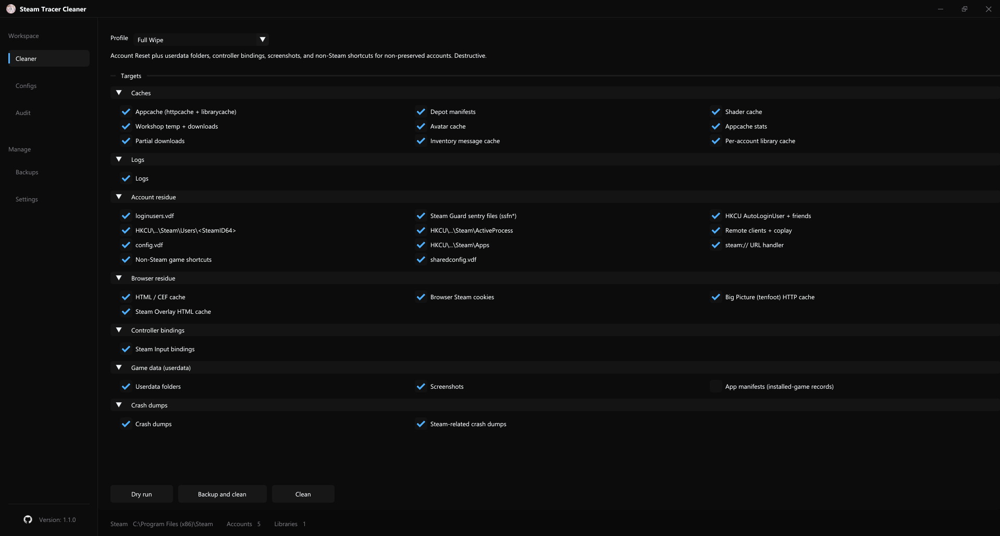

<div align="center">

# Steam Tracer Cleaner

[](https://github.com/luminary-cloud/steam-tracer-cleaner/actions/workflows/ci.yml)
[](../../releases)
[](LICENSE)


A native Windows tool that wipes Steam account residue, installs game configs, and
audits what Steam left on disk. Every destructive action is previewed and backed up
first.

<details>
<summary><b>Show screenshot</b></summary>
<br>

</details>

Single-file executable, no installer, no telemetry. Keeps a preserve list so the
accounts you want survive every cleanup.

</div>

## Features

### Cleaner
- Pick a profile: **Quick Clean** (caches, logs, dumps), **Account Reset** (adds
  account residue), **Full Wipe** (adds userdata, controller bindings, shortcuts),
  or **Game Reset** (wipe just the AppIDs you choose).
- Removes the residue Steam leaves behind: `loginusers.vdf` entries, `ssfn` sentry
  files, `HKCU` Steam user keys and `AutoLoginUser`, app / depot / shader / avatar
  caches, `htmlcache` and overlay caches, crash dumps, browser Steam cookies, and more.
- **Preserve list.** Add the SteamID64s you keep and they survive every wipe: login
  entry, `userdata`, registry subtree, controller bindings, and cached avatar.
- When the active account is wiped, `AutoLoginUser` is redirected to a preserved
  account so Steam reopens to a saved login instead of the blank form.

### Configs
- **Autoexec:** write a `.cfg` into the game's config directory (default is the CS2
  `autoexec.cfg`), backing up any existing file; the destination name is editable.
- **Video config:** write a `cs2_video.txt` into one or more accounts' CS2 config.
- Imported configs are kept in a per-user library so you can re-pick them across runs.
  Installing a config closes only the target game; Steam stays running.

### Audit
- Read-only. Inventories the Steam artifacts on disk, lists every account it sees,
  shows MachineGuid / MachineId / HwProfileGuid, and exports a text report. No writes,
  no registry changes.

### Safe by design
- A **dry run** shows the exact files, keys, and values that would be touched.
- Affected paths are **mirrored to a timestamped backup** before anything is deleted,
  with one-click **restore** from the Backups screen.
- Steam (and, for configs, only the target game) is closed before any write.
- Every action is written to a rotating log. More in [SECURITY.md](SECURITY.md).

### Also
- Optional scheduled clean at logon (Task Scheduler), a launch update check, and
  portable mode (drop a `portable.flag` beside the .exe to keep all data local).

> Not a spoofer. The audit screen displays HWID values but never changes them, and
> nothing here bypasses VAC, EAC, or BattlEye. It is a file cleaner.

## Download

Grab the latest `steam-tracer-cleaner.exe` from the [Releases](../../releases) page.
It is statically linked, so no Visual C++ redistributable is required.

- **Requirements:** Windows 10 or 11, 64-bit. The app runs as administrator (registry
  and per-account `userdata` writes need it).
- **First run:** the binary is unsigned, so SmartScreen may show "Windows protected
  your PC". Click **More info**, then **Run anyway**.

## Build from source

Every dependency is vendored under `third_party/`, so there is no vcpkg or submodule
setup. Open `steam-tracer-cleaner.sln` in Visual Studio 2022/2026 and build
`Release | x64`, or use CMake:

```powershell
cmake --preset release
cmake --build --preset release
```

See [CONTRIBUTING.md](CONTRIBUTING.md) for prerequisites, tests, the project layout,
and the vendored-library list.

## Safety

Cleaning is destructive, so it is gated by a dry-run preview, a full backup with
one-click restore, and a per-action log. The tool keeps everything local and sends no
telemetry. Details and how to report a vulnerability are in [SECURITY.md](SECURITY.md).

## Contributing

Pull requests are welcome. See [CONTRIBUTING.md](CONTRIBUTING.md).

## License

[MIT](LICENSE).